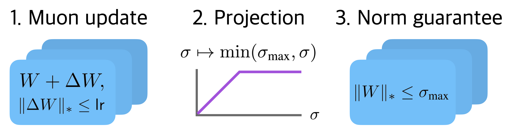

# Training transformers with enforced Lipschitz constants



What if large scale transformer training could be free of loss spikes? Is there a better regularizer than weight decay?

Lipschitz constants are a bound on the model's sensitivity to input or weight changes. By controlling them, we can stabilize training by preventing exploding attention logits, set adversarial robustness bounds in advance, and possibly create models more compatible with low precision inference. We compare pairs of (optimizer, weight constraint method) across AdamW / Muon and existing constraint methods / our proposed methods _spectral cap_ and _spectral hammer_. We find that Muon improves weight constraint methods across the board in the Lipschitz vs. performance tradeoff. And we show that it is possible to train a 145M parameter NanoGPT to competitive accuracy with entirely constrained weights.

As always, there is a lot of work left to train models faster and more scalably (e.g., with Lipschitz guarantees). This repo has a setup to reproduce our results, or train your own Lipschitz-constrained models.

## Setup

1. `git clone https://github.com/Arongil/lipschitz-transformers`
2. `conda create -n lipschitz python=3.9`
3. `conda activate lipschitz`
4. `pip install -e .`

## Train a Lipschitz-enforced transformer

### Warmup #1: MLP on CIFAR-10

```bash
python experiment/train.py \
    --data cifar \
    --batch_size 512 \
    --model_dtype float32 \
    --project_dtype float32 \
    --steps 4000 \
    --lr 0.1 \
    --w_max 2.0 \
    --wd 0.0 \
    --optimizer muon \
    --project '{"default": "soft_cap"}' \
    --beta1 0.9 \
    --beta2 0.95 \
    --schedule linear \
    --accum_steps 1 \
    --log_interval 10 \
    --val_interval 100 \
    --val_iters 10 \
    --seed 0 \
    --job_idx 0
```

### Warmup #2: Shakespeare transformer with 2M parameters

```bash
python experiment/train.py \
    --data shakespeare \
    --seq_len 128 \
    --batch_size 64 \
    --model_dtype float32 \
    --project_dtype float32 \
    --steps 2000 \
    --lr 0.001 \
    --w_max 1.6 \
    --wd 0.0 \
    --optimizer muon \
    --project '{"default": "soft_cap"}' \
    --beta1 0.9 \
    --beta2 0.95 \
    --schedule linear \
    --accum_steps 1 \
    --log_interval 10 \
    --val_interval 100 \
    --val_iters 10 \
    --seed 0 \
    --job_idx 0
```

### The real deal: 145M parameter NanoGPT

The [modded NanoGPT](https://github.com/KellerJordan/modded-nanogpt) repo by Keller Jordan has a wonderful script that trains a GPT-2 small scale transformer in under 3 minutes on an 8xH100. We modified the script to enforce Lipschitz constraints. You can run the script with `/nanogpt/run.sh` -- see the subdirectory's README for setup instructions. There's a default spectral cap example, plus a spectral normalization example.

## Acknowledgments

Thank you to Lambda Labs and Rami Seid for supporting the work with compute credits!

## Citation

```bibtex
@article{newhouse2025lipschitztransformers,
  title={Training Transformers with Enforced Lipschitz Constants},
  author={Laker Newhouse, R. Preston Hess, Franz Cesista, Andrii Zahorodnii, Jeremy Bernstein, Phillip Isola},
  journal={arXiv}
  year={2025}
}
```