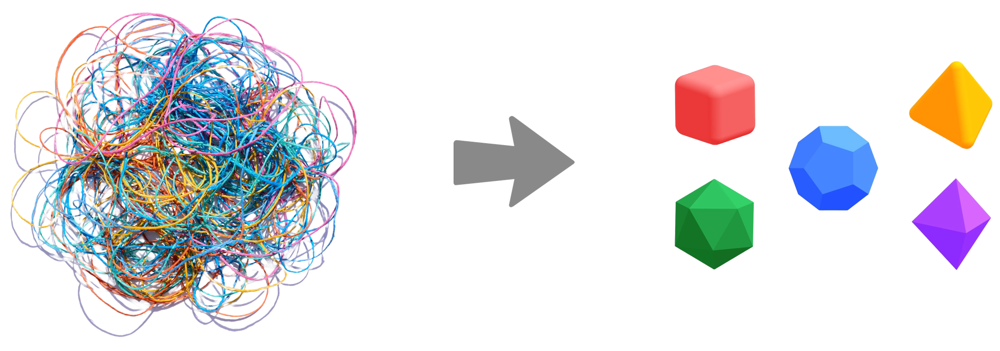

Welcome to the Modula docs!
============================

Modula is a deep learning library and a deep learning theory built hand-in-hand. Modula disentangles complex neural networks and turns them into structured mathematical objects called *modules*. This makes training easier and also provides tools for understanding the properties of the trained network.

Modula instantiates a set of theoretical ideas that I refer to as *metrized deep learning*. The central idea behind metrized deep learning is to equip all spaces inside a neural network with meaningful distance measures: this includes the activation spaces, the individual tensor spaces as well as the overall weight space. There are a few advantages to building neural networks in Modula:

.. grid:: 2
   :gutter: 3

   .. grid-item-card:: Fast 🏎️
      
      Modula automatically builds duality-based training algorithms: think Muon optimizer for any architecture.

   .. grid-item-card::  Scalable 📈

      Scaling is built directly into the fabric of the library, giving you learning rate transfer across various architectural dimensions.

   .. grid-item-card::  Lipschitz (work-in-progress) ⛰️
      
      Modula lets you train networks with automatically constructed Lipschitz certificates---in both inputs and weights.

   .. grid-item-card::  Numerically sound 🧮
      
      Modula helps you understand and control the basic numerical properties of your activations, weights and updates.

About these docs
^^^^^^^^^^^^^^^^^

I'm currently in the process of overhauling these docs. But the idea is to create a central place to learn about the theory, algorithms and code behind Modula. I hope that this will help inspire further research into metrized deep learning.

If something is unclear, first check `the FAQ <faq>`_, but then consider starting a `GitHub issue <https://github.com/jxbz/modula/issues>`_, making a `pull request <https://github.com/jxbz/modula/pulls>`_ or reaching out by email. Then we can improve the docs for everyone.

Navigating the docs
^^^^^^^^^^^^^^^^^^^^

You can use the :kbd:`←` and :kbd:`→` arrow keys to jump around the docs. You can also use the side panel.

Citing the docs
^^^^^^^^^^^^^^^^

The docs currently contain some original research contributions not published anywhere else---in particular, the section on manifold duality maps. If you want to cite the docs, here's some BibTeX:

.. code::
    
    @misc{modula-docs,
      author  = {Jeremy Bernstein},
      title   = {The Modula Docs},
      url     = {https://docs.modula.systems/},
      year    = 2025
    }

.. toctree::
   :hidden:
   :maxdepth: 2
   :caption: Introduction:

   intro/quickstart
   intro/metrized-deep-learning
   intro/reading-list

.. .. toctree::
..    :hidden:
..    :maxdepth: 2
..    :caption: Theory of Modules:

..    theory/vector
..    theory/module
..    theory/atom/index
..    theory/bond/index
..    theory/compound/index

.. toctree::
   :hidden:
   :maxdepth: 2
   :caption: Algorithms:

   algorithms/newton-schulz
   algorithms/manifold/index

.. toctree::
   :hidden:
   :maxdepth: 2
   :caption: Examples:

   examples/hello-world
   examples/hello-mnist
   examples/weight-erasure

.. toctree::
   :hidden:
   :maxdepth: 2
   :caption: More on Modula:

   Modula FAQ <faq>
   Modula codebase <https://github.com/modula-systems/modula>
   Modula homepage <https://modula.systems/>
